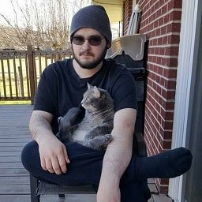

 

<a href="http://steamcommunity.com/id/BetaLeaf">Visit My Steam Page!</a>

<a href="https://BetaLeaf.net">Visit My Website!</a>

 
Bio:
 
I'm Jeff Savage, a Computer Technician, Virus Removal Specialist, and Software Engineer. When I'm not busy with work, I play Dota 2 with my friends. I am also the one that runs this website. If you have any question or would like to join our team, you may email me at <a href="mailto:Jeff@BetaLeaf.net">Jeff@BetaLeaf.net</a>
 

<a href="http://localtimes.info/North_America/United_States/Kentucky/Berea/" style="text-decoration: none; font-size: 13px; color: rgb(0, 0, 0);"> Berea</a>

